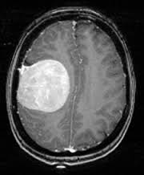
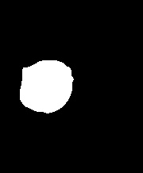

# JbZion Segmentation

## Introduction

JbZion Segmentation is a specialized tool designed for the segmentation of MRI brain tumor images. The primary goal of this project is to accurately isolate the tumor region from the rest of the brain structure in MRI scans.

The algorithm employs a combination of histogram-based dynamic thresholding and luminance edge detection to identify regions of interest. It then uses post-processing morphological operations to refine the segmentation mask, effectively separating the tumor from the background and other brain tissues.

> **Note**: While this project utilizes a custom edge detection module (`detector.py`) internally, the core focus and output of this tool are the segmentation results.

## Prerequisites

To run this project, you need Python installed along with the following libraries:

- `opencv-python`
- `numpy`
- `scipy`
- `matplotlib`

## Installation

You can install the required dependencies using pip:

```bash
pip install opencv-python numpy scipy matplotlib
```

## Usage

To use the segmentation tool in your Python scripts, simply import the `JbZion` module and pass the path of the input image to the `JbZion` function.

Here is a simple example:

```python
import cv2
import JbZion

# Path to the input image
input_image_path = 'orig.jpg'

# Perform segmentation
segmented_image = JbZion.JbZion(input_image_path)

# Save the result
cv2.imwrite('output.jpg', segmented_image)
print("Segmentation complete. Output saved to output.jpg")
```

## Results

Below is a demonstration of the segmentation performance on a sample MRI scan.

| Original Image | Segmented Output |
| :---: | :---: |
|  |  |

The `orig.jpg` shows the raw MRI scan, and `sample_output.jpg` displays the isolated region identified by the JbZion algorithm.
